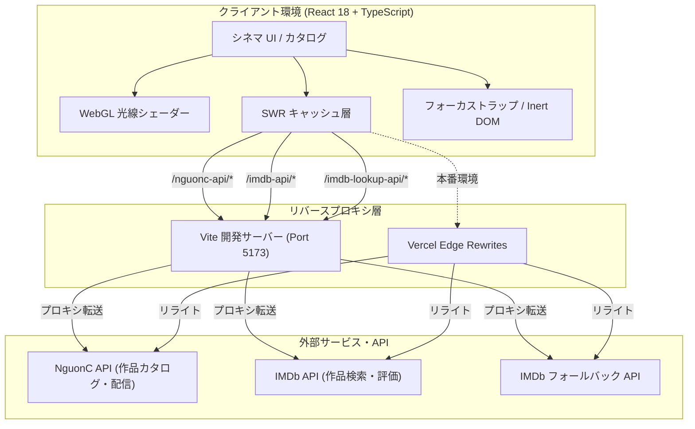

[English](./README.md) | **日本語**

# FuuCine

> React 18、TypeScript、ネイティブ WebGL GLSL シェーダー、Framer Motion で構築した映画ディスカバリー＆ストリーミング・フロントエンド。

[](https://fuucine.vercel.app/)
[](https://react.dev/)
[](https://www.typescriptlang.org/)
[](https://vite.dev/)
[](https://tailwindcss.com/)

---

## 概要

FuuCine は、過剰な広告や重い読み込み、操作性の低いメディアコントロールを排除し、映画館の臨場感ある鑑賞環境を Web 上で再現した映画検索・視聴フロントエンドアプリケーションです。

外部カタログ API と非同期 IMDb レーティング解決エンジンを組み合わせ、生の API データを洗練されたシネマ UI へと変換しています。手続き型 WebGL プロジェクター光線シェーダー、共有レイアウトを活用したモーダル遷移（Match-Cut）、マルチサーバー対応のエピソード選択、および WAI-ARIA に準拠した完全なフォーカス管理を実装しています。

---

## 主な機能

- **作品検索・多軸絞り込み**: 映画（単発）とドラマ（シリーズ）、ジャンル、公開年、制作国による複合絞り込みに加え、クライアントサイドでの IMDb スコア並び替えに対応。
- **デュアルソースによる IMDb レーティング非同期解決**: カタログ作品と IMDb エンドポイントをタイトル・公開年のファジーマッチングで照合し、取得結果を 24 時間 SWR キャッシュ。
- **Match-Cut レイアウト遷移**: Framer Motion の `layoutId` を活用し、映画カードから詳細モーダル、全画面シアタープレイヤーへと滑らかに変形する共有レイアウトアニメーション。
- **ネイティブ WebGL プロジェクターシェーダー**: 外部 3D ライブラリを一切使わず、GLSL レイマーチングと手続き型ノイズによってプロジェクターの光円錐と浮遊塵をシミュレーション。
- **マルチサーバー対応の再生デッキ**: 翻訳形式（Vietsub / Thuyết minh）ごとに配信ソースを自動グループ化し、再生状態のトラッキングとフォールバックに対応。
- **インスタント検索オーバーレイ**: デバウンス処理を備え、キーボードショートカットで素早く呼び出し・クリアできる全画面検索インターフェース。
- **アクセシビリティ（a11y）対応モーダル管理**: フォーカストラップ、Escape キーによる階層的クローズ、背面要素の `inert` 属性分離、閉じる際のトリガー要素へのフォーカス復元を自前実装。
- **チラつきのない（Zero-FOUC）テーマ切り替え**: DOM 描画前に `<head>` 内の同期スクリプトでローカルストレージおよび OS の配色設定を反映。

---

## 技術スタック

| カテゴリ | 採用技術 | バージョン | 役割および選定理由 |
| --- | --- | --- | --- |
| **Frontend** | React | 18.2 | コンポーネント指向 UI、コンカレントレンダリング、Ref を用いた DOM 制御 |
| **Language** | TypeScript | 5.9 | API レスポンス、SWR キー、コンポーネントプロパティの厳格な型安全性の担保 |
| **Build Tool** | Vite | 7.2 | 高速な HMR 開発環境と最適化された Rollup 本番バンドル |
| **Styling** | Tailwind CSS | 3.4 | ユーティリティファースト、CSS 変数、カスタムシネマデザイントークン |
| **Animation** | Framer Motion | 11.18 | `layoutId` による共有レイアウト遷移、モーダル出退場、減速モーション対応 |
| **Data Fetching** | SWR | 2.3 | リクエスト重複排除、バックグラウンド再検証の制御、プログラムによるキャッシュ更新 |
| **Graphics** | WebGL / GLSL | Native | 外部ライブラリなしでの頂点・フラグメントシェーダーによる光線・微粒子描画 |
| **Icons** | Lucide React | 0.323 | 軽量でアクセシブルな SVG アイコンセット |
| **Hosting & Proxy** | Vercel | Production | エッジホスティング、CORS 回避のためのサーバーレスリバースプロキシ設定 |

---

## 技術的な工夫（Technical Highlights）

### 1. ネイティブ WebGL によるプロジェクター光線＆浮遊塵シェーダー（依存関係ゼロの軽量実装）

**課題**  
映画館の雰囲気を再現する光線や空気中の浮遊塵エフェクトは、Three.js などの 3D エンジン（圧縮後 150KB 以上）を導入すると 2D Web アプリケーションにとって過剰なバンドル増と描画負荷の原因になります。

**対応**  
1 つの Canvas 平面（Quad）上で動作するネイティブ WebGL シェーダー（`CinemaProjectorCanvas`）を実装しました。
- 2D レイマーチングとフラクショナル・ブラウン運動（fBm）手続き型ノイズにより、光線の立体的な広がりを計算。
- 時間ユニフォームとノイズマスクを掛け合わせ、空気中に漂う塵のきらめきを表現。
- 低電力モード（`powerPreference: "low-power"`）を指定し、解像度スケールを `min(devicePixelRatio, 1.5)` に制限。マウス座標を線形補間（LERP）で追従。
- `document.visibilityState` イベントを監視し、タブが非アクティブになった際は `requestAnimationFrame` を完全に停止して CPU/GPU 消費を抑制。
- `prefers-reduced-motion: reduce` を検知した場合は Canvas 初期化をスキップし、アクセシビリティに配慮。

**結果**  
外部 3D ライブラリを一切追加することなく、ハードウェアアクセラレーションを活用した高品質な光響効果と、タブ非表示時の低消費電力化を両立しました。

---

### 2. 2 つのソースを活用した IMDb レーティング解決とレートリミット対策

**課題**  
外部カタログ API は IMDb ID の収録状況が不完全です。一覧表示時に多数の作品のレーティングを即時リクエストすると、外部 API のレートリミット（429 Too Many Requests）に抵触し、UI 描画が滞るリスクがありました。

**対応**  
多段階の解決・キャッシュパイプラインを構築しました。
1. **正規表現による ID 抽出**: メタデータ内に `tt\d+` 形式の ID がある場合は直接取得。
2. **ファジーマッチング照合**: ID がない場合、英語原題・メインタイトルで `api.imdbapi.dev` を検索し、タイトル一致度（+6/+5）と公開年一致度（+3）から確度の高い作品を特定。
3. **セカンダリへのフォールバック**: プライマリ検索が失敗またはレート制限された場合、代替エンドポイント（`imdb.iamidiotareyoutoo.com`）へ自動フォールバック。
4. **ビューポート連動の遅延解決**: 各映画カードに `IntersectionObserver`（`rootMargin: "320px 0px"`）を設定し、画面に近づいた作品のみ照合を実行。
5. **バッチ処理による並行数制御**: `waitForBatches` 関数により 6 件単位で並行処理を行い、API 負荷を分散。
6. **24 時間キャッシュ**: SWR の `dedupingInterval: 86_400_000` ms を指定し、重複通信を完全に遮断。

**Result**  
不要な通信を排除し、外部サービスへの負荷を最小限に抑えながら、信頼性の高い IMDb スコアによるクライアントサイド並び替えを実現しました。

---

### 3. WAI-ARIA 準拠のモーダル制御とフォーカストラップ

**課題**  
検索、詳細、プレイヤー、確認ダイアログなど複数のオーバーレイが重なる UI では、Tab キーでのフォーカス逸脱や背後コンテンツの誤読み上げ、スクロールの乱れが発生しやすくなります。

**対応**  
自作フック `useDialogFocus` と背面制御ロジックを実装しました。
- ダイアログ内のフォーカス可能要素（`a`, `button`, `input`, `select`, `textarea`）を走査し、Tab / Shift+Tab 押下時に最初と最後の要素間を循環。
- ドキュメント全体の `Escape` キーを捕捉し、階層順にオーバーレイを閉じる処理を実行。
- オープン時は背面コンテナ（`backgroundRef`）に対して `inert` 属性および `aria-hidden="true"` を付与し、スクリーンリーダーや支援技術からの不要なアクセスを遮断。
- ダイアログを閉じる際、`requestAnimationFrame` を用いて直前に操作していたトリガー要素（`restoreOpener`）へフォーカスを自動復元。

**結果**  
外部の UI ライブラリに依存せず、WAI-ARIA ダイアログ仕様に完全準拠した堅牢なキーボード操作性を確保しました。

---

### 4. Zero-FOUC（描画時の画面チラつき防止）テーマ初期化

**課題**  
React の `useEffect` によるテーマ反映では、初期マウント時に一瞬デフォルトテーマ（白/黒）が表示される FOUC（Flash of Unstyled Content）が発生します。

**対応**  
`index.html` の `<head>` 内、`<body>` 直前にインラインスクリプトを配置しました。
- `localStorage.getItem("theme")` を同期的に取得。
- 未設定の場合は `window.matchMedia("(prefers-color-scheme: dark)")` を判定。
- 初回ペイント前に `document.documentElement` の `data-theme` および `style.colorScheme` を設定。

**結果**  
ダークテーマとライトテーマのどちらにおいても、ページ初回表示時のチラつきを完全に防止しました。

---

## 技術選定・設計判断

### クライアント SPA（Vite） vs. SSR（Next.js）

- **要件**: 滑らかな共有レイアウト遷移（`layoutId`）、リアルタイム Canvas 描画、外部 API を前提とした低遅延なクライアントサイド絞り込み。
- **選択肢**: Next.js App Router（SSR） vs. Vite React SPA。
- **判断**: Vite による React SPA を採用し、Vercel Edge Rewrites（`vercel.json`）で配信。
- **トレードオフ**: 開発時・本番時ともに CORS 回避用のリバースプロキシ設定が必要となりますが、Node.js サーバー運用のオーバーヘッドを排除し、軽快な画面遷移体験を最優先にしました。

### SWR vs. TanStack Query

- **要件**: カタログ一覧のキャッシュ、検索結果の保持、IMDb スコアの非同期解決。
- **選択肢**: TanStack Query vs. SWR。
- **判断**: SWR（`swr@2.3`）を採用。
- **トレードオフ**: 読み込み主体のアプリケーションであるため、必要十分なリクエスト重複排除機能と軽量なバンドルサイズを持つ SWR を選択し、コードベースを簡潔に保ちました。

---

## アーキテクチャ



---

## セットアップ手順

### 必要環境

- Node.js 18 以上（Node 20 以上推奨）
- npm, pnpm, または yarn

### インストールと起動

1. リポジトリのクローン:
   ```bash
   git clone https://github.com/epauengi/fuucine.git
   cd fuucine
   ```

2. 依存関係のインストール:
   ```bash
   npm install
   ```

3. 開発サーバーの起動:
   ```bash
   npm run dev
   ```
   ブラウザで `http://localhost:5173` を開きます。Vite 開発サーバーが自動的に外部 API をプロキシ転送します。

4. 本番用ビルド:
   ```bash
   npm run build
   ```

5. 本番ビルドのローカルプレビュー:
   ```bash
   npm run preview
   ```

---

## API プロキシ設定

ブラウザの CORS 制約を回避し、安全に通信を行うため、以下のパスをリバースプロキシ経由で接続しています。

| パス | 転送先 | 設定ファイル | 用途 |
| --- | --- | --- | --- |
| `/nguonc-api/*` | `https://phim.nguonc.com/api` | `vite.config.ts` / `vercel.json` | 作品カタログ、カテゴリ一覧、検索、エピソード配信 URL |
| `/imdb-api/*` | `https://api.imdbapi.dev` | `vite.config.ts` / `vercel.json` | プライマリ IMDb 作品検索およびスコア照会 |
| `/imdb-lookup-api/*` | `https://imdb.iamidiotareyoutoo.com` | `vite.config.ts` / `vercel.json` | セカンダリ IMDb ID 照合フォールバック |

---

## ディレクトリ構成

```text
├── index.html              # エントリ HTML・FOUC 防止テーマ同期スクリプト
├── package.json            # 依存関係およびスクリプト
├── tsconfig.json           # TypeScript コンパイラ設定
├── vite.config.ts          # Vite 設定および開発用リバースプロキシ
├── vercel.json             # 本番用 Vercel デプロイ・リライト設定
├── src/
│   ├── main.tsx            # アプリケーション起動・グローバル SWR/Motion 設定
│   ├── App.tsx             # メインアプリケーション・状態管理・モーダル群
│   ├── index.css           # Tailwind 定義・カスタムデザイントークン
│   ├── vite-env.d.ts       # Vite クライアント型定義
│   ├── components/
│   │   └── ui/
│   │       ├── cinema-projector-canvas.tsx  # ネイティブ WebGL GLSL シェーダー
│   │       └── theme-toggle.tsx            # ダーク/ライトテーマ切り替え
│   └── lib/
│       └── utils.ts        # クラス結合ヘルパー（clsx + tailwind-merge）
```

---

## 免責事項

> [!IMPORTANT]
> FuuCine は技術実証およびポートフォリオを目的とした非商用フロントエンドプロジェクトです。作品メタデータ、ポスター画像、エピソード配信リンク、埋め込みメディアはすべてサードパーティの公開エンドポイント（NguonC および IMDb 関連サービス）から提供されています。当リポジトリおよびホスティング先では動画メディアファイルの保管・配信は一切行っておりません。

---

## 開発者

- **Nguyen Dinh Phong** — [@epauengi](https://github.com/epauengi)
- 公開デモ: [fuucine.vercel.app](https://fuucine.vercel.app/)
