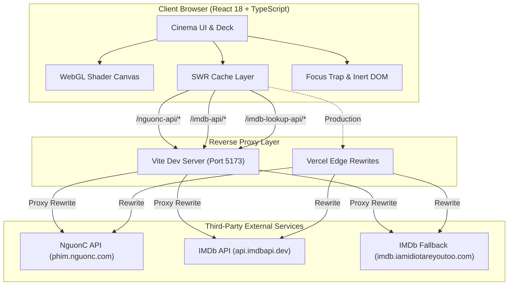

**English** | [日本語](./README.ja.md)

# FuuCine

> High-performance cinematic film discovery and streaming frontend built with React 18, TypeScript, custom WebGL GLSL shaders, and Framer Motion.

[](https://fuucine.vercel.app/)
[](https://react.dev/)
[](https://www.typescriptlang.org/)
[](https://vite.dev/)
[](https://tailwindcss.com/)

---

## Overview

FuuCine is a movie discovery and streaming web application engineered to deliver a theater-grade visual experience without the bloat, intrusive advertisements, or unresponsive layouts common to public media portals.

Powered by external catalog endpoints and an asynchronous IMDb rating resolution engine, FuuCine transforms raw API feeds into an interactive cinema deck featuring procedural WebGL projector beams, shared-layout modal transitions, multi-server episode streaming, and full WAI-ARIA accessible focus management.

---

## Key Features

- **Film Discovery & Multi-Criteria Filtering**: Filter catalog titles by format (series vs. single films), genre, production year, and country, paired with client-side IMDb score sorting.
- **Dual-Source IMDb Rating Resolution**: Asynchronous background pipeline that matches films against IMDb search endpoints using fuzzy title/year scoring and caches scores for 24 hours.
- **Match-Cut Layout Transitions**: Seamless Framer Motion transitions (`layoutId`) morphing film cards directly into detail dialogs and fullscreen cinema player modes.
- **Native WebGL Projector Shader**: Custom GLSL raymarching and procedural noise canvas simulating projector light cones and floating dust particles with zero external 3D libraries.
- **Multi-Server Playback Deck**: Automatically groups media streams by translation format (Vietsub vs. Thuyết minh) with active episode tracking and fallback recovery.
- **Instant Search Overlay**: Debounced, keyboard-navigable search interface with query clearing and immediate catalog filtering.
- **Accessible Dialog Orchestration**: Complete WAI-ARIA modal implementation with focus trapping, Escape key listener, background `inert` isolation, and trigger focus restoration.
- **Zero-FOUC Dark/Light Theming**: Pre-hydration inline script synchronizing system preferences and local storage prior to DOM rendering.

---

## Tech Stack

| Category | Technology | Version | Purpose & Architectural Justification |
| --- | --- | --- | --- |
| **Framework** | React | 18.2 | Component-driven UI with concurrent rendering and ref-based DOM orchestration |
| **Language** | TypeScript | 5.9 | Strict type definitions across API payloads, SWR keys, and component contracts |
| **Build Tool** | Vite | 7.2 | Fast HMR development server and optimized Rollup production bundling |
| **Styling** | Tailwind CSS | 3.4 | Utility-first styling with custom design tokens, CSS variables, and layout isolation |
| **Animation** | Framer Motion | 11.18 | Shared layout transitions (`layoutId`), modal presence, and reduced-motion handling |
| **Data Fetching** | SWR | 2.3 | Cache deduplication, background revalidation control, and programmatic cache mutation |
| **Graphics** | WebGL / GLSL | Native | Custom vertex and fragment shaders for atmospheric light and particle simulation |
| **Icons** | Lucide React | 0.323 | Lightweight, accessible SVG iconography |
| **Hosting & Proxy** | Vercel | Production | Edge hosting with serverless reverse-proxy rewrites to bypass browser CORS |

---

## Technical Highlights

### 1. Custom WebGL Projector & Particle Shader (Zero-Dependency 3D)

**Problem**  
Creating an authentic cinematic atmosphere with volumetric light rays and atmospheric dust particles typically requires heavy 3D runtimes (e.g., Three.js, ~150KB+ min/gzip), which introduces unnecessary CPU/GPU overhead for a 2D web application.

**Approach**  
Implemented a native WebGL fragment shader (`CinemaProjectorCanvas`) on a single quad:
- Uses 2D raymarching with fractional Brownian motion (fBm) procedural noise to generate dynamic volumetric light beams.
- Generates floating dust particles using power-curved noise masks synchronized with an internal elapsed-time uniform.
- Employs low-power WebGL contexts (`powerPreference: "low-power"`), caps resolution scaling to `min(devicePixelRatio, 1.5)`, and tracks mouse coordinates with smooth linear interpolation.
- Integrates `document.visibilityState` listeners to completely cancel `requestAnimationFrame` loops when the browser tab is backgrounded.
- Detects `prefers-reduced-motion: reduce` at initialization to bypass canvas rendering entirely.

**Result**  
Delivered an atmospheric, hardware-accelerated theater lighting effect with zero third-party 3D dependencies and automatic power conservation on inactive tabs.

---

### 2. Resilient Dual-Source IMDb Rating Pipeline & Concurrency Throttling

**Problem**  
External catalog APIs provide inconsistent IMDb identifiers. Looking up ratings on the fly for dozens of catalog items risks triggering rate limits (`429 Too Many Requests`) and blocking UI rendering.

**Approach**  
Engineered a multi-tier resolution and caching pipeline:
1. **Direct Identifier Extraction**: Parses metadata for regex pattern `tt\d+`.
2. **Fuzzy Title Matching**: When missing, queries `api.imdbapi.dev` with primary and original titles, scoring candidates based on title match (+6/+5) and release year (+3).
3. **Secondary Fallback**: If the primary search fails or is rate-limited, falls back to a secondary lookup endpoint (`imdb.iamidiotareyoutoo.com`).
4. **Viewport-Gated Lazy Resolution**: Movie cards use `IntersectionObserver` (`rootMargin: "320px 0px"`) so rating lookups only trigger when cards approach the viewport.
5. **Batch Processing**: Slices rating requests into controlled batches of 6 (`waitForBatches`) to respect API concurrency limits.
6. **24-Hour Cache**: Stores resolved ratings in SWR with `dedupingInterval: 86_400_000` ms.

**Result**  
Eliminated redundant network requests, protected external endpoints from flooding, and enabled client-side catalog sorting by verified IMDb score.

---

### 3. Accessible Dialog Orchestration & Focus Trap Pattern

**Problem**  
Media applications with nested overlays (Search, Details, Player, Disclosure notices) frequently suffer from focus loss, keyboard traps, and background page scrolling.

**Approach**  
Built a reusable focus trap and overlay manager (`useDialogFocus`):
- Restricts keyboard Tab navigation strictly within active dialog boundaries using DOM querying of interactive elements (`a`, `button`, `input`, `select`, `textarea`).
- Wraps focus circularly between the first and last interactive element.
- Listens for `Escape` key events at the document level to dismiss top overlays in hierarchical order.
- Applies the HTML `inert` attribute and `aria-hidden="true"` to the background application container (`backgroundRef`) to prevent screen readers and assistive tech from accessing blurred content.
- Restores focus to the originating trigger button (`restoreOpener`) upon dialog closure via `requestAnimationFrame`.

**Result**  
Full compliance with WAI-ARIA modal dialog specifications without requiring third-party headless UI dependencies.

---

### 4. Zero-FOUC Theme Initialization

**Problem**  
Relying on React `useEffect` for theme initialization causes a flash of unstyled content or wrong theme colors (FOUC) on cold page loads.

**Approach**  
Embedded a synchronous script in `index.html` executing immediately before `<body>` parsing:
- Reads stored preference from `localStorage.getItem("theme")`.
- Falls back to `window.matchMedia("(prefers-color-scheme: dark)")`.
- Sets `data-theme` and `style.colorScheme` on `document.documentElement` synchronously before initial layout paint.

**Result**  
Instant, flicker-free rendering on both dark and light display modes.

---

## Engineering Decisions

### Client-Side SPA with Vite vs. SSR / Next.js

- **Constraint**: The project requires smooth layout morphing (`layoutId`), dynamic canvas rendering, and low-latency client-side filtering over third-party APIs.
- **Alternatives**: Next.js App Router (SSR) vs. Vite SPA.
- **Decision**: Vite React SPA deployed on Vercel with edge rewrites (`vercel.json`).
- **Trade-off**: Requires reverse proxy configurations to prevent CORS issues in development and production, but avoids server runtime overhead and provides instant client-side transitions.

### SWR vs. TanStack Query

- **Constraint**: The application is primarily read-heavy with catalog fetching, search, and rating lookups.
- **Alternatives**: TanStack Query vs. SWR.
- **Decision**: SWR (`swr@2.3`).
- **Trade-off**: SWR provides lightweight cache deduplication and programmatic mutation (`mutateSWR`) with a fraction of the bundle size, fulfilling all required catalog caching requirements without boilerplate.

---

## Architecture



---

## Getting Started

### Prerequisites

- Node.js 18+ (tested on Node 20+)
- npm, pnpm, or yarn

### Installation

1. Clone the repository:
   ```bash
   git clone https://github.com/epauengi/fuucine.git
   cd fuucine
   ```

2. Install dependencies:
   ```bash
   npm install
   ```

3. Start development server:
   ```bash
   npm run dev
   ```
   Open `http://localhost:5173` in your browser. The Vite development server automatically proxies upstream API requests to bypass CORS.

4. Build for production:
   ```bash
   npm run build
   ```

5. Preview production build locally:
   ```bash
   npm run preview
   ```

---

## API Proxy Configuration

The application accesses third-party services through predefined reverse proxies to protect upstream headers and bypass browser cross-origin restrictions:

| Route Path | Upstream Target | Environment Handler | Purpose |
| --- | --- | --- | --- |
| `/nguonc-api/*` | `https://phim.nguonc.com/api` | `vite.config.ts` / `vercel.json` | Film catalog, category lists, search, episode streams |
| `/imdb-api/*` | `https://api.imdbapi.dev` | `vite.config.ts` / `vercel.json` | Primary IMDb title search and rating queries |
| `/imdb-lookup-api/*` | `https://imdb.iamidiotareyoutoo.com` | `vite.config.ts` / `vercel.json` | Secondary IMDb identifier lookup fallback |

---

## Project Structure

```text
├── index.html              # Entry HTML & pre-hydration zero-FOUC theme script
├── package.json            # Dependencies & scripts
├── tsconfig.json           # TypeScript compiler configuration
├── vite.config.ts          # Vite configuration & dev reverse proxies
├── vercel.json             # Production deployment rewrites
├── src/
│   ├── main.tsx            # React application bootstrap & global SWR/Motion configs
│   ├── App.tsx             # Main cinema application, state boundaries & modals
│   ├── index.css           # Tailwind layers, custom cinema design tokens & masks
│   ├── vite-env.d.ts       # Vite client type declarations
│   ├── components/
│   │   └── ui/
│   │       ├── cinema-projector-canvas.tsx  # Native WebGL GLSL shader canvas
│   │       └── theme-toggle.tsx            # Dark/light theme toggle button
│   └── lib/
│       └── utils.ts        # Shared clsx and tailwind-merge helper (cn)
```

---

## Content Notice & Disclaimer

> [!IMPORTANT]
> FuuCine is a non-commercial frontend demonstration and portfolio project. All film metadata, posters, episode streaming links, and embedded playback media originate from third-party public endpoints (NguonC and IMDb-related services). This repository does not host, store, or distribute any media files or video streams.

---

## Author

- **Nguyen Dinh Phong** — [@epauengi](https://github.com/epauengi)
- Live Project: [fuucine.vercel.app](https://fuucine.vercel.app/)
